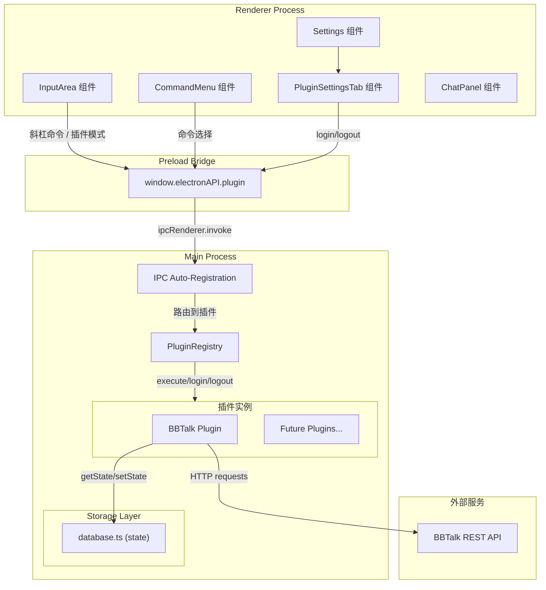
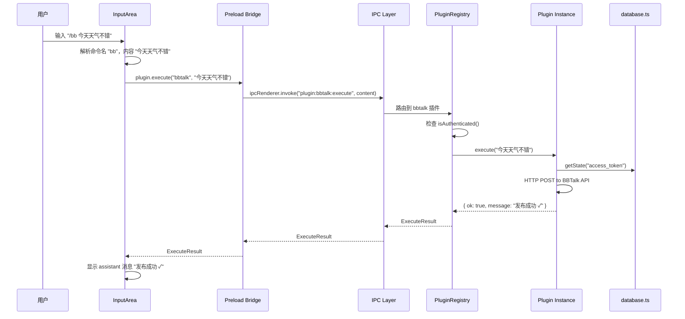
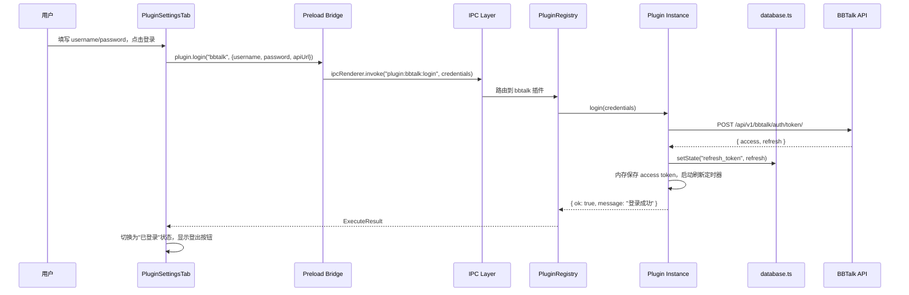
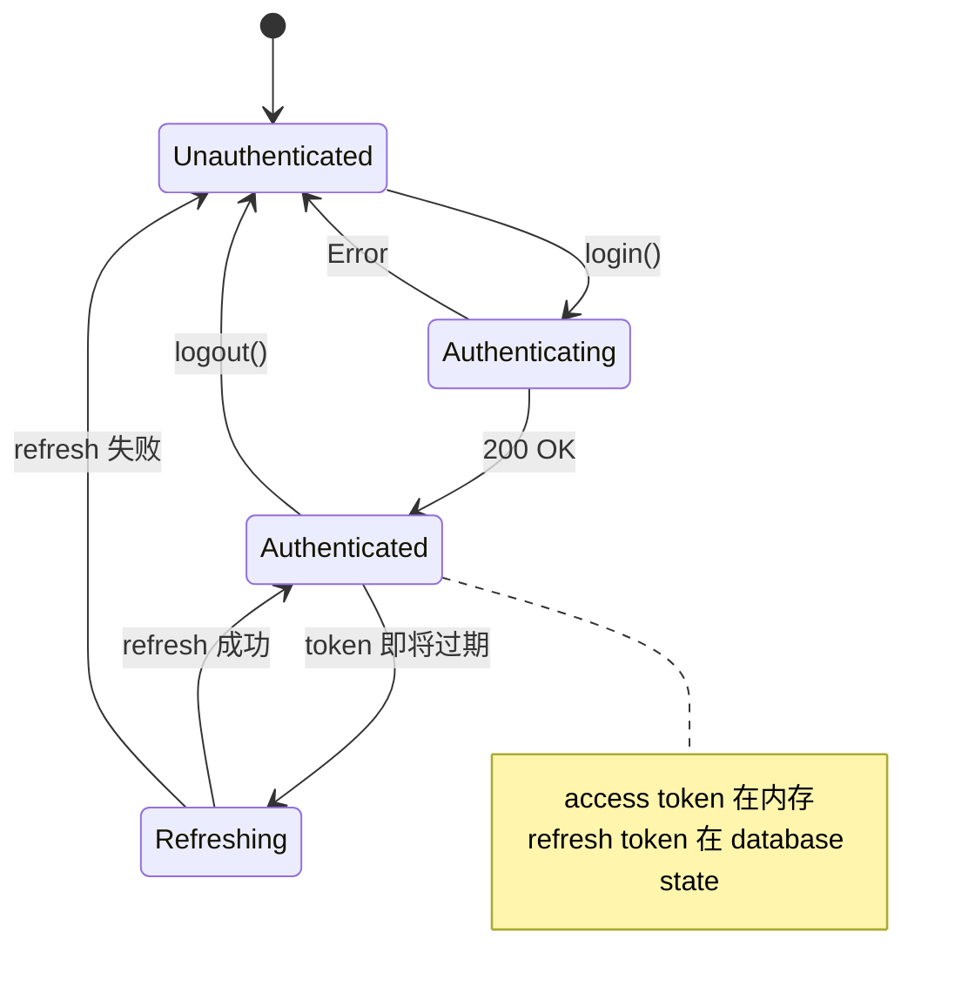

# 技术设计文档：ChouYu 插件系统

## 概述

ChouYu 插件系统为桌面 AI 宠物助手提供标准化的第三方集成能力。采用**约定式静态注册**架构，插件以 TypeScript 模块形式存在于 Main Process，通过框架自动建立的 IPC 通道与 Renderer Process 通信。

### 设计目标

- **零配置接入**：插件开发者只需实现 `PluginDefinition` 接口，框架自动处理 IPC、命令注册、设置面板
- **类型安全**：全链路 TypeScript 类型覆盖，编译期捕获接口错误
- **命名空间隔离**：插件数据通过 key 前缀隔离，互不干扰
- **双触发模式**：斜杠命令 + 工具栏图标按钮，满足不同使用习惯

### 核心设计决策

| 决策 | 选择 | 理由 |
|------|------|------|
| 运行位置 | Main Process | 需要网络访问、token 存储、无 CORS 限制 |
| 加载方式 | 静态导入 + 注册表 | 简单可靠，TypeScript 类型检查，无动态加载风险 |
| 数据存储 | 复用 database.ts state | 避免引入新依赖，key 前缀隔离足够 |
| IPC 模式 | 自动注册 handle 通道 | 减少样板代码，约定优于配置 |
| 认证 UI | 声明式自动生成 | 插件开发者无需了解 React/UI 实现 |

## 架构

### 系统集成架构图



### 数据流：命令执行



### 数据流：认证流程



## 组件与接口

### 核心类型定义 (`src/main/plugins/types.ts`)

```typescript
/** 插件执行结果 */
export interface ExecuteResult {
  ok: boolean
  message: string
}

/** 认证字段声明 */
export interface AuthField {
  key: string
  label: string
  type: 'text' | 'password' | 'url'
  placeholder?: string
  required?: boolean       // 默认 true
  persistent?: boolean     // 默认 false，登录后是否仍显示
}

/** 认证方式类型 */
export type AuthType = 'credentials' | 'apikey' | 'token'

/** 插件定义接口 */
export interface PluginDefinition {
  // 必填字段
  id: string                    // kebab-case 唯一标识
  command: string               // 斜杠命令名（不含 /）
  name: string                  // 人类可读名称
  description: string           // 命令菜单提示文字

  // 必填方法
  execute(content: string): Promise<ExecuteResult>

  // 可选：认证相关
  authType?: AuthType           // 默认 'credentials'
  authFields?: AuthField[]
  login?(credentials: Record<string, string>): Promise<ExecuteResult>
  logout?(): Promise<void>
  isAuthenticated?(): boolean

  // 可选：生命周期
  init?(): Promise<void>

  // 可选：UI 增强
  icon?: string                 // emoji 或 SVG path
  inputPlaceholder?: string     // 插件输入模式占位文字
  requiresContent?: boolean     // 是否必须有内容输入
}

/** 插件元数据（传递给 Renderer 的安全子集） */
export interface PluginInfo {
  id: string
  command: string
  name: string
  description: string
  icon?: string
  inputPlaceholder?: string
  requiresContent?: boolean
  hasAuth: boolean
  authType?: AuthType
  authFields?: AuthField[]
}

/** 插件存储上下文（传递给插件实例的工具） */
export interface PluginContext {
  getState(key: string): string | null
  setState(key: string, value: string): void
}
```

### 插件注册表 (`src/main/plugins/registry.ts`)

```typescript
import { ipcMain } from 'electron'
import { PluginDefinition, PluginInfo, PluginContext, ExecuteResult } from './types'
import { getState, setState } from '../database'

// 静态导入所有插件
import { bbtalkPlugin } from './bbtalk'

/** 已注册插件列表 */
const PLUGINS: PluginDefinition[] = [
  bbtalkPlugin
]

class PluginRegistry {
  private plugins: Map<string, PluginDefinition> = new Map()
  private contexts: Map<string, PluginContext> = new Map()

  /** 初始化所有插件并注册 IPC 通道 */
  async initialize(): Promise<void> {
    // 检查命令冲突
    this.checkCommandConflicts()

    // 注册插件并创建上下文
    for (const plugin of PLUGINS) {
      const context = this.createContext(plugin.id)
      this.contexts.set(plugin.id, context)
      this.plugins.set(plugin.id, plugin)
    }

    // 初始化插件（init 失败不影响其他插件）
    for (const plugin of PLUGINS) {
      if (plugin.init) {
        try {
          await plugin.init()
        } catch (err) {
          console.error(`[Plugin] ${plugin.id} init failed:`, err)
        }
      }
    }

    // 自动注册 IPC 通道
    this.registerIpcChannels()
  }

  /** 获取所有插件 */
  getPlugins(): PluginDefinition[] {
    return Array.from(this.plugins.values())
  }

  /** 按 ID 查找插件 */
  getPlugin(id: string): PluginDefinition | undefined {
    return this.plugins.get(id)
  }

  /** 获取插件元数据列表（安全传递给 Renderer） */
  getPluginInfos(): PluginInfo[] {
    return this.getPlugins().map((p) => ({
      id: p.id,
      command: p.command,
      name: p.name,
      description: p.description,
      icon: p.icon,
      inputPlaceholder: p.inputPlaceholder,
      requiresContent: p.requiresContent,
      hasAuth: !!p.authFields && p.authFields.length > 0,
      authType: p.authType,
      authFields: p.authFields
    }))
  }

  private checkCommandConflicts(): void {
    const commands = new Map<string, string>()
    for (const plugin of PLUGINS) {
      if (commands.has(plugin.command)) {
        throw new Error(
          `[Plugin] Command conflict: "/${plugin.command}" is registered by both "${commands.get(plugin.command)}" and "${plugin.id}"`
        )
      }
      commands.set(plugin.command, plugin.id)
    }
  }

  private createContext(pluginId: string): PluginContext {
    return {
      getState: (key: string) => getState(`plugin:${pluginId}:${key}`),
      setState: (key: string, value: string) => setState(`plugin:${pluginId}:${key}`, value)
    }
  }

  private registerIpcChannels(): void {
    for (const plugin of this.getPlugins()) {
      // execute 通道（所有插件必有）
      ipcMain.handle(`plugin:${plugin.id}:execute`, async (_event, content: string) => {
        return this.executePlugin(plugin, content)
      })

      // login 通道（可选）
      if (plugin.login) {
        ipcMain.handle(`plugin:${plugin.id}:login`, async (_event, credentials: Record<string, string>) => {
          return plugin.login!(credentials)
        })
      }

      // logout 通道（可选）
      if (plugin.logout) {
        ipcMain.handle(`plugin:${plugin.id}:logout`, async () => {
          return plugin.logout!()
        })
      }

      // isAuthenticated 通道（可选）
      if (plugin.isAuthenticated) {
        ipcMain.handle(`plugin:${plugin.id}:is-authenticated`, async () => {
          return plugin.isAuthenticated!()
        })
      }
    }

    // 全局：获取插件列表
    ipcMain.handle('plugin:get-plugins', async () => {
      return this.getPluginInfos()
    })
  }

  private async executePlugin(plugin: PluginDefinition, content: string): Promise<ExecuteResult> {
    // 认证前检查
    if (plugin.authFields && plugin.isAuthenticated && !plugin.isAuthenticated()) {
      return { ok: false, message: `请先在设置中登录 ${plugin.name}` }
    }

    // 内容必填检查
    if (plugin.requiresContent && !content.trim()) {
      return { ok: false, message: `请输入内容：/${plugin.command} ${plugin.description}` }
    }

    // 执行插件
    try {
      return await plugin.execute(content)
    } catch (err: any) {
      return { ok: false, message: `插件执行出错：${err.message || err}` }
    }
  }
}

export const pluginRegistry = new PluginRegistry()
```

### Preload Bridge 扩展

在 `src/preload/index.ts` 中新增 `plugin` 命名空间：

```typescript
plugin: {
  execute: (pluginId: string, content: string) =>
    ipcRenderer.invoke(`plugin:${pluginId}:execute`, content),
  login: (pluginId: string, credentials: Record<string, string>) =>
    ipcRenderer.invoke(`plugin:${pluginId}:login`, credentials),
  logout: (pluginId: string) =>
    ipcRenderer.invoke(`plugin:${pluginId}:logout`),
  isAuthenticated: (pluginId: string) =>
    ipcRenderer.invoke(`plugin:${pluginId}:is-authenticated`),
  getPlugins: () =>
    ipcRenderer.invoke('plugin:get-plugins')
}
```

### UI 集成设计

#### CommandMenu 扩展

现有 `COMMANDS` 数组改为动态合并内置命令与插件命令：

```typescript
// 内置命令（保持不变）
const BUILTIN_COMMANDS = [
  { cmd: '/clear', desc: '清空对话，新话题' },
  { cmd: '/settings', desc: '打开设置' },
  { cmd: '/model', desc: '切换模型' },
  { cmd: '/help', desc: '查看可用指令' }
]

// 插件命令在组件挂载时从 Main Process 获取
const [pluginCommands, setPluginCommands] = useState<{cmd: string, desc: string}[]>([])

useEffect(() => {
  window.electronAPI.plugin.getPlugins().then((plugins) => {
    setPluginCommands(plugins.map(p => ({
      cmd: `/${p.command}`,
      desc: p.description
    })))
  })
}, [])

// 合并后的完整命令列表
const COMMANDS = [...BUILTIN_COMMANDS, ...pluginCommands]
```

#### InputArea 工具栏插件按钮

在工具栏左侧（截图/附件按钮旁）添加插件快捷按钮：

```typescript
// 插件输入模式状态
const [activePlugin, setActivePlugin] = useState<PluginInfo | null>(null)

// 进入插件模式
const enterPluginMode = (plugin: PluginInfo) => {
  setActivePlugin(plugin)
  // placeholder 切换为插件定义的文字
  // 发送按钮文字变化
}

// 退出插件模式
const exitPluginMode = () => {
  setActivePlugin(null)
}

// 发送时判断模式
const handleSend = () => {
  if (activePlugin) {
    // 通过插件 execute 执行
    window.electronAPI.plugin.execute(activePlugin.id, value)
  } else {
    // 正常 AI 聊天
    onSend(value)
  }
}
```

工具栏渲染逻辑：
- 带 `icon` 的插件 ≤ 2 个：直接显示图标按钮
- 带 `icon` 的插件 > 2 个：显示前 2 个 + "⋯" 更多菜单

#### Settings 插件标签页

在 `NAV_ITEMS` 中动态添加插件设置项：

```typescript
// 动态生成插件导航项
const pluginNavItems = plugins
  .filter(p => p.hasAuth)
  .map(p => ({
    key: `plugin-${p.id}`,
    label: p.name,
    icon: p.icon || '🔌'
  }))
```

`PluginSettingsTab` 组件根据 `authType` 渲染不同 UI：
- `credentials`：用户名 + 密码 + 登录按钮
- `apikey`：API Key 输入 + 保存按钮
- `token`：Token 输入 + 保存按钮

## 数据模型

### 存储 Schema

插件数据存储在 `database.ts` 的 `state` 字段中，使用命名空间前缀：

```
state: {
  "plugin:bbtalk:refresh_token": "eyJ...",
  "plugin:bbtalk:api_url": "https://bbtalk.cone387.top",
  "plugin:bbtalk:username": "user123",
  "plugin:{pluginId}:{key}": "value"
}
```

### BBTalk 插件存储键

| Key | 说明 | 示例值 |
|-----|------|--------|
| `refresh_token` | JWT refresh token | `eyJhbGciOiJIUzI1NiJ9...` |
| `api_url` | API 服务地址 | `https://bbtalk.cone387.top` |
| `username` | 登录用户名 | `cone` |

### 类型扩展

在 `src/renderer/src/shared/types.ts` 中扩展 `ElectronAPI`：

```typescript
export interface ElectronAPI {
  // ... 现有字段 ...
  plugin: {
    execute: (pluginId: string, content: string) => Promise<ExecuteResult>
    login: (pluginId: string, credentials: Record<string, string>) => Promise<ExecuteResult>
    logout: (pluginId: string) => Promise<void>
    isAuthenticated: (pluginId: string) => Promise<boolean>
    getPlugins: () => Promise<PluginInfo[]>
  }
}
```

## Correctness Properties

*A property is a characteristic or behavior that should hold true across all valid executions of a system—essentially, a formal statement about what the system should do. Properties serve as the bridge between human-readable specifications and machine-verifiable correctness guarantees.*

### Property 1: Plugin registry lookup completeness

*For any* set of registered plugins, `getPlugins()` SHALL return all registered plugins, and `getPlugin(id)` SHALL return the correct plugin for any registered ID and `undefined` for any unregistered ID.

**Validates: Requirements 2.3, 2.4**

### Property 2: Command duplicate detection

*For any* two plugins that declare the same `command` value, the registry initialization SHALL throw an error identifying the conflict.

**Validates: Requirements 2.5**

### Property 3: Init failure resilience

*For any* set of plugins where some plugins' `init()` methods throw exceptions, all non-throwing plugins SHALL still be available in the registry after initialization.

**Validates: Requirements 2.6**

### Property 4: Command parsing and content extraction

*For any* string starting with `/` followed by a registered command name and a space, the Command Router SHALL correctly extract the command name (text between `/` and first space) and the content (text after first space), routing to the correct plugin.

**Validates: Requirements 3.1, 3.2**

### Property 5: Execute error wrapping

*For any* exception thrown by a plugin's `execute()` method, the Plugin Executor SHALL return `{ ok: false, message: "插件执行出错：{error.message}" }` without propagating the exception.

**Validates: Requirements 3.6**

### Property 6: IPC channel auto-registration

*For any* registered plugin, the framework SHALL register a `plugin:{pluginId}:execute` IPC handle channel. Additionally, *for any* plugin that declares `login`, `logout`, or `isAuthenticated` methods, the corresponding `plugin:{pluginId}:{method}` IPC channels SHALL also be registered.

**Validates: Requirements 4.1, 4.2, 4.3, 4.4**

### Property 7: State namespace isolation

*For any* two distinct plugins A and B, and *for any* key K and value V, when plugin A calls `setState(K, V)`, plugin B's `getState(K)` SHALL return `null` (not V). The underlying storage key SHALL be `plugin:{pluginId}:{K}`.

**Validates: Requirements 5.1, 5.2, 5.3**

### Property 8: Content requirement validation

*For any* plugin with `requiresContent: true` and *for any* empty or whitespace-only content string, the executor SHALL return an error prompt without calling `execute()`. Conversely, *for any* plugin without `requiresContent` or with `requiresContent: false`, empty content SHALL be passed to `execute()`.

**Validates: Requirements 8.1, 8.2**

### Property 9: Authentication pre-execution check

*For any* plugin that declares `authFields` and whose `isAuthenticated()` returns `false`, execution attempts SHALL return `{ ok: false, message: "请先在设置中登录 {plugin.name}" }`. *For any* plugin without `authFields`, execution SHALL proceed directly without auth check.

**Validates: Requirements 9.1, 9.2**

## 错误处理

### 错误分类与处理策略

| 错误场景 | 处理方式 | 用户可见信息 |
|----------|----------|-------------|
| 插件 init() 失败 | 记录日志，继续加载其他插件 | 无（静默） |
| 命令冲突 | 启动时抛出错误，阻止应用启动 | 开发者错误，不应到达用户 |
| 未认证执行 | 返回 ExecuteResult.ok=false | "请先在设置中登录 {name}" |
| 缺少必填内容 | 返回 ExecuteResult.ok=false | "请输入内容：/{command} ..." |
| execute() 异常 | 捕获并包装为 ExecuteResult | "插件执行出错：{message}" |
| 网络请求失败 | 插件内部处理，返回 ok=false | "发布失败：网络错误" |
| Token 过期 | 自动 refresh，失败则提示重新登录 | "登录已过期，请重新登录" |
| login() 失败 | 返回 ExecuteResult.ok=false | 显示具体错误信息 |

### BBTalk 插件错误处理

```typescript
// Token 刷新失败时的降级策略
async function ensureAuthenticated(): Promise<string | null> {
  if (accessToken && !isTokenExpired(accessToken)) {
    return accessToken
  }
  // 尝试 refresh
  const refreshed = await refreshAccessToken()
  if (refreshed) return accessToken
  // refresh 也失败，清除状态
  accessToken = null
  return null
}
```

## 测试策略

### 属性测试（Property-Based Testing）

本特性适合 PBT，因为核心逻辑涉及：
- 输入解析（命令路由）
- 数据映射（状态命名空间）
- 条件分支（认证检查、内容校验）
- 集合操作（注册表查找）

**PBT 库选择**：[fast-check](https://github.com/dubzzz/fast-check)（TypeScript 生态最成熟的 PBT 库）

**配置**：
- 每个属性测试最少 100 次迭代
- 每个测试标注对应的设计属性编号

**标签格式**：`Feature: plugin-system, Property {N}: {property_text}`

### 测试分层

| 层级 | 测试类型 | 覆盖范围 |
|------|----------|----------|
| 单元测试 | fast-check 属性测试 | Properties 1-9（注册表、路由、命名空间、校验） |
| 单元测试 | 示例测试 | 命令菜单渲染、设置面板 UI、具体错误消息 |
| 集成测试 | Mock HTTP | BBTalk 登录/发布/刷新流程 |
| 集成测试 | IPC 模拟 | Preload → Main 通信链路 |

### 属性测试示例

```typescript
import fc from 'fast-check'

// Feature: plugin-system, Property 7: State namespace isolation
test('plugin state namespace isolation', () => {
  fc.assert(
    fc.property(
      fc.string({ minLength: 1 }),  // pluginIdA
      fc.string({ minLength: 1 }),  // pluginIdB
      fc.string({ minLength: 1 }),  // key
      fc.string(),                   // value
      (idA, idB, key, value) => {
        fc.pre(idA !== idB)
        const ctxA = createContext(idA)
        const ctxB = createContext(idB)
        ctxA.setState(key, value)
        expect(ctxB.getState(key)).toBeNull()
      }
    ),
    { numRuns: 100 }
  )
})
```

### BBTalk 集成测试

使用 mock HTTP 验证：
1. 登录成功 → 存储 refresh token
2. 登录失败 → 返回错误信息
3. 发布成功 → 返回成功消息
4. Token 过期 → 自动刷新后重试
5. Refresh 失败 → 提示重新登录


## BBTalk 插件实现设计

### 模块结构 (`src/main/plugins/bbtalk/index.ts`)

```typescript
import { PluginDefinition, ExecuteResult, PluginContext } from '../types'
import { getState, setState } from '../../database'

const PLUGIN_ID = 'bbtalk'
const DEFAULT_API_URL = 'https://bbtalk.cone387.top'

// 内存中的 access token（不落盘）
let accessToken: string | null = null
let refreshTimer: ReturnType<typeof setTimeout> | null = null

// 插件上下文（由 registry 注入前自行构建，因为是静态模块）
const ctx: PluginContext = {
  getState: (key) => getState(`plugin:${PLUGIN_ID}:${key}`),
  setState: (key, value) => setState(`plugin:${PLUGIN_ID}:${key}`, value)
}

function getApiUrl(): string {
  return ctx.getState('api_url') || DEFAULT_API_URL
}

function parseJwtExp(token: string): number | null {
  try {
    const payload = JSON.parse(Buffer.from(token.split('.')[1], 'base64url').toString())
    return payload.exp ?? null
  } catch {
    return null
  }
}

function scheduleRefresh(token: string): void {
  if (refreshTimer) clearTimeout(refreshTimer)
  const exp = parseJwtExp(token)
  if (!exp) return
  const delay = exp * 1000 - Date.now() - 5 * 60 * 1000 // 提前5分钟刷新
  if (delay > 0) {
    refreshTimer = setTimeout(() => refreshAccessToken(), delay)
  } else {
    refreshAccessToken()
  }
}

async function refreshAccessToken(): Promise<boolean> {
  const refreshToken = ctx.getState('refresh_token')
  if (!refreshToken) return false

  try {
    const res = await fetch(`${getApiUrl()}/api/v1/bbtalk/auth/token/refresh/`, {
      method: 'POST',
      headers: { 'Content-Type': 'application/json' },
      body: JSON.stringify({ refresh: refreshToken })
    })
    if (!res.ok) {
      accessToken = null
      return false
    }
    const data = await res.json()
    accessToken = data.access
    if (data.refresh) {
      ctx.setState('refresh_token', data.refresh)
    }
    scheduleRefresh(data.access)
    return true
  } catch {
    accessToken = null
    return false
  }
}

export const bbtalkPlugin: PluginDefinition = {
  id: PLUGIN_ID,
  command: 'bb',
  name: 'BBTalk',
  description: '发布内容到 BBTalk',
  icon: '📝',
  inputPlaceholder: '记点什么...',
  requiresContent: true,
  authType: 'credentials',
  authFields: [
    { key: 'apiUrl', label: 'API 地址', type: 'url', placeholder: DEFAULT_API_URL, required: false, persistent: true },
    { key: 'username', label: '用户名', type: 'text', required: true },
    { key: 'password', label: '密码', type: 'password', required: true }
  ],

  async init(): Promise<void> {
    // 启动时尝试恢复登录态
    const refreshToken = ctx.getState('refresh_token')
    if (refreshToken) {
      await refreshAccessToken()
    }
  },

  async login(credentials: Record<string, string>): Promise<ExecuteResult> {
    const { username, password, apiUrl } = credentials
    const url = apiUrl || DEFAULT_API_URL

    // 保存 API URL（如果用户自定义了）
    if (apiUrl) {
      ctx.setState('api_url', apiUrl)
    }

    try {
      const res = await fetch(`${url}/api/v1/bbtalk/auth/token/`, {
        method: 'POST',
        headers: { 'Content-Type': 'application/json' },
        body: JSON.stringify({ username, password })
      })

      if (!res.ok) {
        const err = await res.json().catch(() => ({}))
        return { ok: false, message: err.detail || err.error || `HTTP ${res.status}` }
      }

      const data = await res.json()
      accessToken = data.access
      ctx.setState('refresh_token', data.refresh)
      ctx.setState('username', username)
      scheduleRefresh(data.access)

      return { ok: true, message: '登录成功' }
    } catch (e: any) {
      return { ok: false, message: e.message || '网络错误' }
    }
  },

  async logout(): Promise<void> {
    accessToken = null
    if (refreshTimer) clearTimeout(refreshTimer)
    ctx.setState('refresh_token', '')
  },

  isAuthenticated(): boolean {
    return !!accessToken
  },

  async execute(content: string): Promise<ExecuteResult> {
    // 确保 token 有效
    if (!accessToken) {
      const refreshed = await refreshAccessToken()
      if (!refreshed) {
        return { ok: false, message: '登录已过期，请重新登录' }
      }
    }

    try {
      const res = await fetch(`${getApiUrl()}/api/v1/bbtalk/`, {
        method: 'POST',
        headers: {
          'Content-Type': 'application/json',
          'Authorization': `Bearer ${accessToken}`
        },
        body: JSON.stringify({ content, visibility: 'private' })
      })

      if (res.status === 401) {
        // Token 过期，尝试刷新后重试
        const refreshed = await refreshAccessToken()
        if (!refreshed) {
          return { ok: false, message: '登录已过期，请重新登录' }
        }
        // 重试一次
        const retry = await fetch(`${getApiUrl()}/api/v1/bbtalk/`, {
          method: 'POST',
          headers: {
            'Content-Type': 'application/json',
            'Authorization': `Bearer ${accessToken}`
          },
          body: JSON.stringify({ content, visibility: 'private' })
        })
        if (!retry.ok) {
          return { ok: false, message: `发布失败：HTTP ${retry.status}` }
        }
        return { ok: true, message: '发布成功 ✓' }
      }

      if (!res.ok) {
        const err = await res.json().catch(() => ({}))
        return { ok: false, message: `发布失败：${err.detail || err.error || `HTTP ${res.status}`}` }
      }

      return { ok: true, message: '发布成功 ✓' }
    } catch (e: any) {
      return { ok: false, message: `发布失败：${e.message || '网络错误'}` }
    }
  }
}
```

### 认证状态机



## 文件结构总览

```
src/
├── main/
│   ├── plugins/
│   │   ├── types.ts              # PluginDefinition, ExecuteResult, AuthField 等类型
│   │   ├── registry.ts           # PluginRegistry 类，IPC 自动注册
│   │   └── bbtalk/
│   │       └── index.ts          # BBTalk 插件实现
│   ├── database.ts               # 现有，无需修改
│   ├── ipc.ts                    # 现有，新增 pluginRegistry.initialize() 调用
│   └── index.ts                  # 现有，启动时初始化插件系统
├── preload/
│   └── index.ts                  # 新增 plugin 命名空间
└── renderer/
    └── src/
        ├── shared/
        │   └── types.ts          # 扩展 ElectronAPI 类型
        └── components/
            ├── ChatPanel/
            │   ├── CommandMenu.tsx    # 合并插件命令
            │   ├── InputArea.tsx      # 新增插件模式
            │   └── ChatPanel.tsx      # 处理插件执行结果
            └── Settings/
                ├── Settings.tsx       # 动态添加插件导航项
                └── PluginSettingsTab.tsx  # 新增：插件认证设置组件
```
