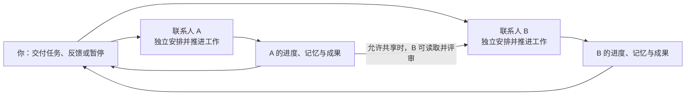

# 联系人持续工作与 24h 实验架构

更新：2026-09-30。以下为当前代码实现。

## 一张图看懂

每个联系人按自己的任务、进度、预算和时间安排工作。**联系人之间并行，同一联系人内串行**：A 正在生成、等待资料或等你回复时，B 可以继续工作。暂停或删除 A，只中止 A 的工作。

同一联系人可以接下多个任务，忙碌时先存入本地队列。当前任务完成、暂停或等待用户回复时，按接单顺序接续已安排任务；待回复任务保留自己的检查点，回复后在执行轮次之间恢复。不会自动执行旧的未安排事项。每个已安排任务保存独立的下次执行时间，后台切换不会切走用户正在查看的任务。

每日调用上限与单任务跨天累计预算独立校验：暂停任务不预占其他任务的每日容量。模型首次预算按配置的一日调用上限收紧，用户可以单独指定更大的跨天预算；已有任务预算仍不能由模型自行追加。排队本身不消耗调用，今日额度不足时保留队列等待恢复。

每轮主要做四件事：**决定下一步 → 读取资料或直接创作 → 保存成果与进度 → 安排下一轮**。需要你的补充才停下来询问，回复后接着做。

## 24h 实验怎样协作

- **阿想**：按 15 分钟节奏产出 idea，将正文保存成成果并允许共享。
- **阿衡**：按 15 分钟节奏检查，读取阿想的实际正文后独立评分，保存自己的评审成果。
- **不重复评审**：按分节内容指纹识别已处理内容；内容变化后可以重新评审。
- **到期停止**：实验初次启动时设置 24 小时截止时间，重启沿用原时间。两人可以同时工作；评审依赖已保存的成果，不等待作者整个任务结束。

实验仅在开发环境显式使用 `--idea-lab` 时创建。约 96 轮是节奏目标，实际会受生成耗时、离线、追问和预算影响。作者每日调用上限为 240，评审员为 400；任务另有跨天累计预算。

## 保留哪些边界

| 事项 | 当前规则 |
| --- | --- |
| 运行位置 | 本地后台；关闭聊天继续，退出应用、关机或休眠时停止，恢复后接续 |
| 联系人并行 | 不设全局单执行槽；各联系人最多一轮实际执行，可保留多个待回复事项，按持久化安排接续任务 |
| 一轮工作时间 | **取消固定 120 秒总时限**，多个步骤可以按需完成 |
| 单次请求超时 | 模型请求仍为 90 秒；网页请求也保留超时，避免单个请求永久挂住。它不限制整个多步骤轮次的总时长 |
| 停止条件 | 用户暂停/删除、实验截止、预算不足、事项结束；连续三轮失败关闭自动工作 |
| 数据 | 各自的进度、记忆、报告和成果版本按联系人隔离；只有授权共享的成果能被其他联系人读取 |
| 恢复 | 工作状态与检查点存本地；中断步骤可以恢复，错过的周期不逐次补跑 |

原先整轮限时是防挂起措施，但一个轮次包含多次请求，统一的两分钟截止会中断正常推进。现在由单次请求超时、调用预算、有限执行步骤和用户暂停控制，不再给整轮设置固定倒计时。

并行执行仍共用一个后台进程和本地数据库，**尚未做到每个联系人独立进程的故障隔离**。模型请求可同时在途，数据库短事务依然顺序提交。共享供应商也可能有自己的限流。

## 下一步值得优化

1. **持续任务结束规则**：把“持续到截止时间”变成明确的任务属性，防止模型提前宣布整个实验完成。
2. **后台故障隔离**：当前控制请求超时可能重启共用进程；应区分慢操作和进程失联，减少对其他联系人的影响。
3. **成果更新通知**：作者保存新成果后主动唤醒评审，减少定时检查的等待。
4. **历史存储**：减少成果版本重复保存全文，给已评审内容建立索引，降低长期运行成本。

## 维护入口

- [调度与并行执行](../src/main/agents/service.ts)：联系人执行状态、暂停、删除、退出。
- [每轮工作流程](../src/main/agents/runtime.ts)：规划、资料读取、生成、询问与提交。
- [工作数据](../src/main/agents/store.ts)、[成果版本](../src/main/agents/delivery.ts)：预算、进度与持久化。
- [成果共享](../src/main/agents/contact-sources.ts)、[24h 实验](../src/main/agents/idea-lab.ts)：协作与实验参数。

运行规则改变时同步本文及[使用说明](contact-topics.md)，架构图只保留角色和主要关系。相关验证：`npm test -- src/main/agents`、`npm run typecheck:node`；模拟测试不代替真实供应商的 24 小时耐久验收。
