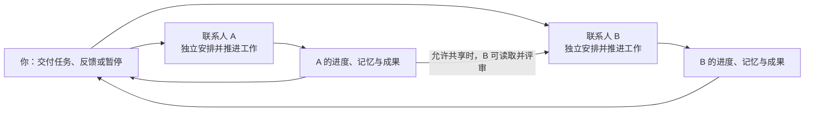
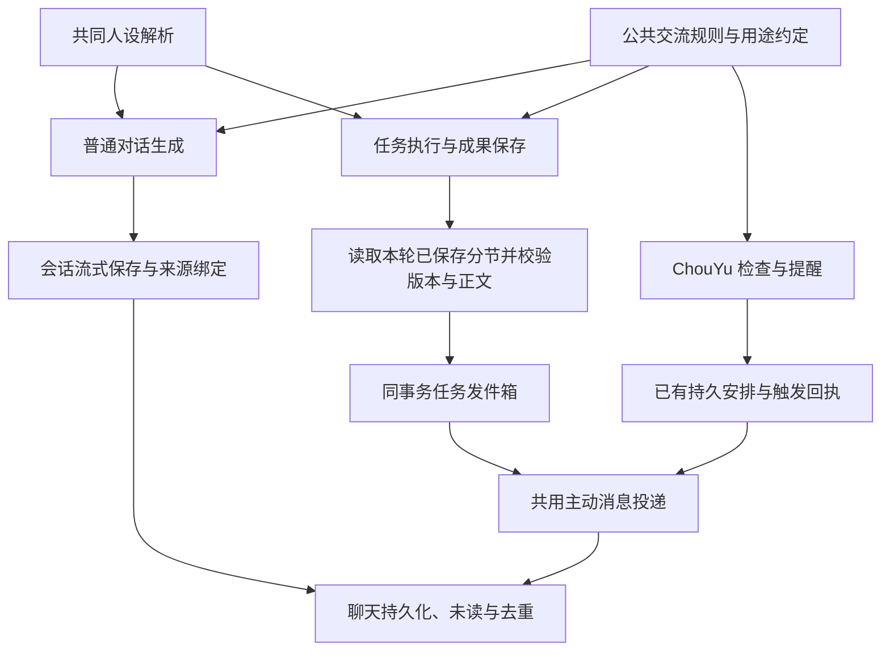

# 联系人持续工作与 24h 实验架构

更新：2026-10-09。以下为当前代码实现。产品与 UI 约束统一以 [联系人任务 spec](contact-task-spec.md) 为准；实现差距见该文第 10 节。

## 一张图看懂

每个联系人按自己的任务、进度、预算和时间安排工作。**联系人之间并行，同一联系人按「最多同时推进任务数」执行（默认 1），同一任务仍串行**。等待回复、下次执行和不可恢复的资源等待释放执行名额；暂停或删除仅中止本任务，请求未退出前继续占名额。

2026-10-10：服务按 run ID 管理执行控制器，按联系人计数、按任务防重入。调高上限立即补位；调低后当前轮次可完成。新交付任务先接单，后续按到期时间轮转。正在执行的轮次暂留可确定的调用容量，实际调用仍事务计数和预留 Token，排队不记消耗。`task_failures` 按任务保存失败次数、来源轮次和下次时间，升级归入真实旧失败（含已有在途重试），成功只清本任务。恢复、资源卡片和任务状态按任务读取；普通聊天工具与任务页复用同一队列。ChouYu 的问候、提醒和定时安排保持原引擎，不纳入持续任务上限。见 [并发推进验收](contact-concurrency-20261010.md)。

同一联系人可以接下多个任务，忙碌时先存入本地队列。当前任务完成、暂停或等待用户回复时，按接单顺序接续已安排任务；待回复任务保留自己的检查点，回复后在执行轮次之间恢复。不会自动执行旧的未安排事项。每个已安排任务保存独立的下次执行时间，后台切换不会切走用户正在查看的任务。

每日调用上限与单任务跨天累计预算独立校验：暂停任务不预占其他任务的每日容量。模型首次预算按配置的一日调用上限收紧，用户可以单独指定更大的跨天预算；已有任务预算仍不能由模型自行追加。排队本身不消耗调用，今日额度不足时保留队列等待恢复。

联系人工作设置对其所有任务生效，分为自动工作、资料与协作权限、进展通知。任务设置直接打开共用的单任务描述弹窗，不再展示多字段配置或继承规则。普通任务编辑通过统一网关解析描述中的目标、约束和明确的预算数字；后台验证并保存后才反馈成功。所有任务的实际调用共用联系人每日额度，也计入各自累计预算；提高其中一个上限不会自动提高另一个。

调整每日额度、搜索次数、通知、共享开关、创作节奏或每日工作时段不会取消正在执行或等待回复的轮次。切换按需保留运行与待回复轮次；切换节奏更新后续创作调度，保留资料检查退避。修改网页访问范围、参考网页、搜索开关、读取联系人成果权限，会取消未完成轮次；保存前明确提示这一影响。搜索密钥单独保存，修改仍会取消未完成轮次。

联系人自动推进不再设置总截止日期，旧 workUntil 在启动时清理，保存校验、手动执行、自动调度和工作日志均不再依据它拦截。每日工作时段独立生效，暂停、待回复及预算限制仍保留。

每轮主要做四件事：**决定下一步 → 读取资料或直接创作 → 保存成果与进度 → 安排下一轮**。需要你的补充才停下来询问，回复后接着做。

## 24h 实验怎样协作

- **阿想**：按 15 分钟节奏产出 idea，将正文保存成成果并允许共享。
- **阿衡**：按 15 分钟节奏检查，读取阿想的实际正文后独立评分，保存自己的评审成果。
- **不重复评审**：按分节内容指纹识别已处理内容；内容变化后可以重新评审。
- **实验时限**：旧 24 小时联系人截止配置已随本轮移除；实验时间保留在任务描述中，不能再宣称联系人层会到期自动停止。两人可以同时工作；评审依赖已保存成果。

实验仅在开发环境显式使用 `--idea-lab` 时创建。约 96 轮是节奏目标，实际会受生成耗时、离线、追问和预算影响。作者每日调用上限为 240，评审员为 400；任务另有跨天累计预算。

## 保留哪些边界

| 事项 | 当前规则 |
| --- | --- |
| 运行位置 | 本地后台；关闭聊天继续，退出应用、关机或休眠时停止，恢复后接续 |
| 联系人并行 | 不设全局单执行槽；各联系人最多一轮实际执行，可保留多个待回复事项，按持久化安排接续任务 |
| 一轮工作时间 | **取消固定 120 秒总时限**，多个步骤可以按需完成 |
| 单次请求超时 | 模型请求仍为 90 秒；网页请求也保留超时，避免单个请求永久挂住。它不限制整个多步骤轮次的总时长 |
| 停止条件 | 用户暂停/删除、预算不足、事项结束；连续三轮失败阻塞自动调度，保留用户选择的工作方式 |
| 数据 | 各自的进度、记忆、报告和成果版本按联系人隔离；只有授权共享的成果能被其他联系人读取 |
| 恢复 | 工作状态与检查点存本地；中断步骤可以恢复，错过的周期不逐次补跑 |

原先整轮限时是防挂起措施，但一个轮次包含多次请求，统一的两分钟截止会中断正常推进。现在由单次请求超时、调用预算、有限执行步骤和用户暂停控制，不再给整轮设置固定倒计时。

并行执行仍共用一个后台进程和本地数据库，**尚未做到每个联系人独立进程的故障隔离**。模型请求可同时在途，数据库短事务依然顺序提交。共享供应商也可能有自己的限流。

## 下一步值得优化

1. **持续任务结束规则**：把“持续到截止时间”变成明确的任务属性，防止模型提前宣布整个实验完成。
2. **后台故障隔离**：当前控制请求超时可能重启共用进程；应区分慢操作和进程失联，减少对其他联系人的影响。
3. **成果更新通知**：作者保存新成果后主动唤醒评审，减少定时检查的等待。
4. **历史存储**：减少成果版本重复保存全文，给已评审内容建立索引，降低长期运行成本。

## 维护入口

联系人技能由 `src/main/skills/library.ts` 保存共享安装库及独立关联，`skillhub.ts` 适配官方固定版本 Python CLI，`index.ts` 提供严格 IPC 和快照入口。数据位于 `userData/contact-skills`，与其他 Agent 技能目录分离。普通聊天按已核对联系人 ID 读取；后台 worker 在实际开轮时读取同一库，将完整技能上下文及摘要保存到 `run.input.skills`，避免身份同步间隔造成新轮配置滞后。恢复原轮沿用保存快照，技能不是 soul 的组成部分，也不触发人设变化取消。主进程 ChouYu 晨报/工作检查复用同一解析服务；详见 [技能验收](contact-skills-20261010.md)。

- [调度与并行执行](../src/main/agents/service.ts)：联系人执行状态、暂停、删除、退出。
- [每轮工作流程](../src/main/agents/runtime.ts)：规划、资料读取、生成、询问与提交。
- [工作数据](../src/main/agents/store.ts)、[成果版本](../src/main/agents/delivery.ts)：预算、进度与持久化。
- [成果共享](../src/main/agents/contact-sources.ts)、[24h 实验](../src/main/agents/idea-lab.ts)：协作与实验参数。

运行规则改变时同步本文及[使用说明](contact-topics.md)，架构图只保留角色和主要关系。相关验证：`npm test -- src/main/agents`、`npm run typecheck:node`；模拟测试不代替真实供应商的 24 小时耐久验收。

### 任务体验与执行记录（2026-09-30）

- 联系人任务入口显示总数，列表同时显示启用/进行中数量；未配置时间的晨间总结是安排建议，不计入任务总数。
- 所有联系人共用目标、状态、待回复、下一步与最新进展优先的概览；消耗、工作时间和预算按需展开。不具备用量数据的任务只说明未记录，不渲染空统计卡。
- 窄容器使用同一套阶段导航的横向布局；联系人资料内进入任务时收起角色资料。任务编辑、新建与删除继续使用公共弹窗，输入控件不添加聚焦彩色边框。
- 定时安排的历史单独存于 `assistant-routine-history:<id>`，记录每次尝试的计划时间、实际时间、成功/失败/取消、结果和消息定位。按稳定记录位置分页，新增记录不干扰更早页面；旧数据只显示已保存的最后一次结果，不补造历史。
- 定时消息用送达回执派生稳定消息 ID，保留原有持久去重机制。查看消息定位到具体会话/消息，历史消息视图不将未展示的新消息标为已读。
- 晨报先读取各联系人状态，模型汇总变化、阻塞与待决定事项。任务入口由已核对的 ID 生成；点击后再次检查任务存在性，在公共联系人任务窗口中打开，不自动启动、回复或修改任务。
- 新建时缺失必要信息继续追问，弹窗保留原始要求与每次补充；失败保留当前输入。
- 任务设置直接复用新建任务弹窗，仅显示一个任务描述输入框，不再提供结构化标题、目标、约束、调整原因、工作规则或预算编辑。普通任务将描述保存为目标，旧约束合并预填；定时任务继续调用模型解析描述中的时间与要求。内置陪伴职责在同一弹窗只读展示固定规则，启停仍在任务页操作。

### 2026-10-09 工作设置与 Token 限额

工作设置全部平铺；选择即保存，数值直接编辑并在本行应用，使用设置版本防止并发覆盖。每日工作 Token 限额与新任务累计默认限额分开保存；默认值只复制给新任务，已有任务经单描述网关调整。每次后台模型请求通过独立 SQLite ledger 预留额度并限制输出，正常返回按用量结算；未知用量保守预留，删除任务不返还当日消耗。旧调用没有用量时暂按每次 32768 Token 估算，无法重建真实账单。已有配置不自动加限额。详见 [验收记录](work-settings-acceptance-20261009.md)。

## 公共交流与投递架构（2026-10-09）

所有联系人使用相同的交流协议，不按预设角色名称分流。`resolveCharacterSoul` 是聊天、执行器与模型配置的共同人设入口：自定义人设保留，空人设的新角色使用自己的名字与中性身份，不继承 ChouYu 的助手人设。

`src/shared/contact-communication.ts` 独立于人设和执行引擎，提供公共交流规则及 conversation/task/briefing 场景补充。普通聊天通过服务端 contactWorkInstructions 注入，接单、正文、修订、恢复通过运行器注入，晨报与问候工作检查通过各自生成入口注入。任务解析、工具参数、评分与规划继续遵循机器结构，不强行套成聊天格式。

消息 `communication` 元数据记录版本、所属联系人、用途和来源：普通回复是会话来源；任务消息是任务与轮次来源，实际交付另带成果版本及分节；主动消息是触发事件回执。该结构不新增设置 UI，也不决定联系人必须使用何种文风。

`AgentStore.finish` 先在事务内写成果版本，再读取实际分节创建通知；通知检查任务归属、轮次、版本、分节及正文一致性。报告或后续步骤失败时整笔事务回滚，不能提前交付。没有实际新增且证据未变化时不重发。后续修订不改变先前未送达的正文快照。

`appendAgentNotice` 与 `appendAssistantMessage` 是兼容适配器，内部统一调用 `appendContactMessage`，保留旧回执 key、未读时序和清空后的去重。拒绝空白、超长和错配消息，不能切掉正文后说已送达。普通聊天继续流式写会话，不增加统一润色模型；其来源由后端按当前会话绑定，不能从客户端冒充成果版本。自动保存保留已投递主动消息原文与来源，仍允许用户明确清空历史。

发送前的结构和来源校验是确定性逻辑。自然语言是否得体仍由公共提示和原有有界纠正控制，不做不可靠的全局替换，不另加逐消息模型审核费用。工作检查的确定性列表只呈现状态与真实问题，不再直接附加内部判断/下一步；失败时保持有限事实和正确任务入口。

验收与未覆盖边界见 [联系人消息验收](contact-messaging-acceptance-20261009.md)。
