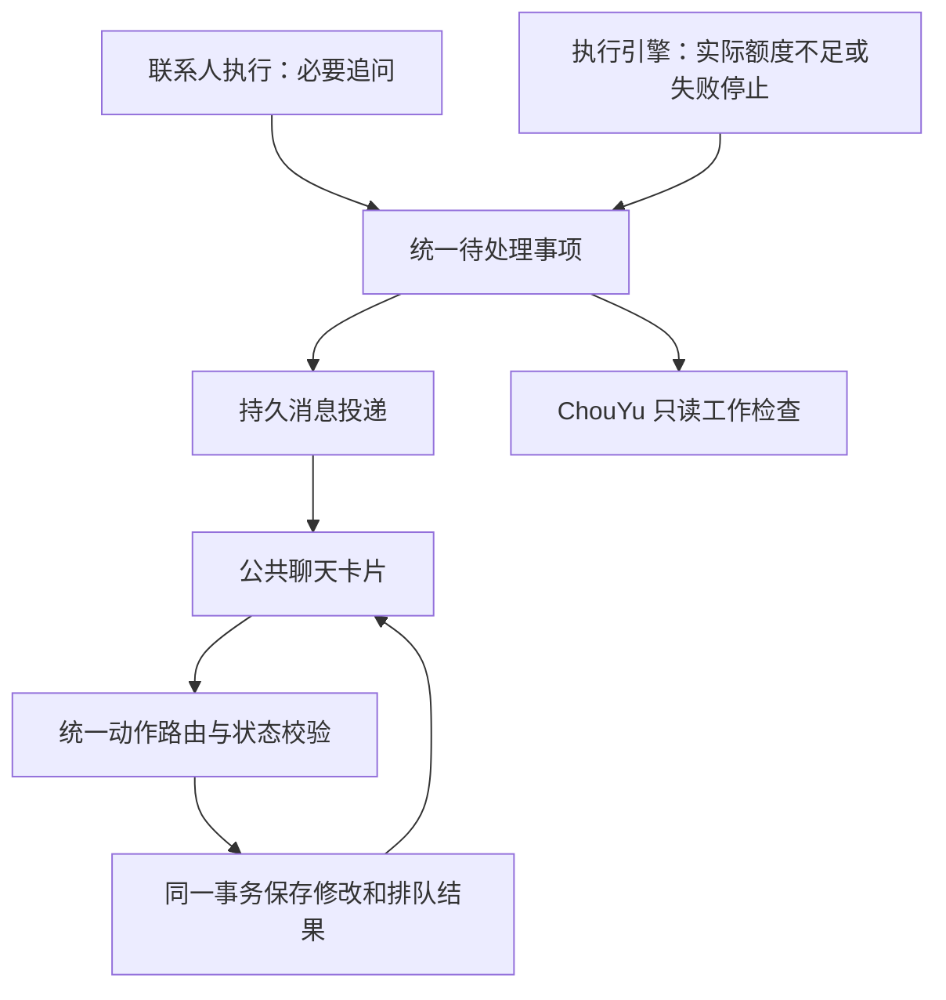

# 联系人交互式卡片：架构与验收（2026-10-09）

遵循 [现行产品规范](contact-task-spec.md)。普通任务表单仍只有任务描述；这里是用户明确要求的聊天内阻塞处理。

## 实现与职责

- 联系人继续负责内容和必要问题；引擎根据真实状态生成预算或失败事项。卡片按钮由固定动作协议决定，模型不能生成可执行代码或自行加预算。
- `ContactInteractions` 与任务共用 SQLite；记录联系人、任务、轮次、版本、问题与待处理/已处理/失效状态。消息仅携带 interactionId，展示时读取最新状态。
- 所有联系人，包括新建角色，共用 `ContactInteractionCard`、IPC 和动作服务，不按人设复制组件。
- ChouYu 的工作检查可读取同一份待处理列表；不替用户回复、提高额度或批准他人的任务。2026-10-10 已接入汇总引用和统一待处理入口，见下文。

## 已接入的交互

| 场景 | 直接操作 | 提交后 |
| --- | --- | --- |
| 真实资源不足 | 展示所有当前受限额度、已用量和本轮所需；直接输入上限 | 同时保存并排队继续 |
| 必要信息缺失 | 在卡片内填写回复；若同时缺预算，同卡处理 | 绑定原问题、恢复原轮次 |
| 失败后已停止自动重试 | 点击重试本任务；若缺预算，同时填写 | 只产生一次重试，不擅自开启自动工作 |

额度区分任务累计调用、联系人每日调用、任务累计 Token、联系人每日 Token。未设置 Token 上限代表无限制，不制造预算阻塞。调用数根据规划/执行检查点计算；Token 使用当前记录的预留需求，并非供应商精确账单承诺。后续请求估算变化仍可能产生新的真实阻塞。

卡片不折叠字段，不跳设置页，不增加“修改”步骤。失败保留输入和具体错误；成功显示“已排队”，不能声称任务完成。普通成果仍直接交付正文。

## 状态和可靠性

- 提交使用立即事务，重新读取当前状态、版本和消耗后校验；额度变更、回答/排队和操作回执一并提交，任何一步失败全部回滚。
- 重复点击、跨窗口提交与重启后的重复请求返回已保存回执，不重复加额度或创建轮次。
- 任务被改动、主动暂停、结束、删除或已有新轮次时，旧卡片失效；联系人归属严格校验。额度阻塞本身产生的暂停可以由有效卡片恢复。
- 老消息不改写。启动时只给仍保留在聊天中且仍有效的旧阻塞补发一次卡片；已清空历史不被补发恢复。
- 每日额度耗尽导致的排队/到期任务也检查实际预算，避免静默等待；仍沿用现有持久投递、去重和未读闪烁。

## 验收

受影响条款：UI-03/05、NL-04、RUN-02/03、RES-01、MSG-01、SCOPE-01。

- `npm run typecheck`：通过。
- 全量 `npm test -- --maxWorkers=2`：1199 项通过、2 项跳过；随后补充 ChouYu 只读转发用例，相关三组 34 项通过。结果见 `temp/contact-interactions-full-tests.log`。
- `npm run build`：通过。
- `node scripts/smoke-electron.js --agents`：隔离 Electron、本地模型夹具，直接回复、实际预算落盘并排队、失败注入后事务回滚与输入保留、双击去重、过期卡片、消息引用持久化均验证。日志 `temp/contact-interactions-smoke.log`。
- 专项单元测试覆盖归属、删除、手动暂停、同库重开、多个上限、外部回复后下一次追问、停止重试阈值、每日 Token 检查点恢复、旧阻塞升级去重和清空历史。
- 截图位于 `temp/contact-interactions-ui/contact-interaction-{light,dark}-{375,1024}.png`，实际检查宽窄布局、输入框聚焦、深浅主题。主题截图等待切换动画结束，避免把过渡帧误当最终界面。

本次不改变真实联系人的预算或用户暂停状态。隔离验收不代表真实模型全天运行已验收。授权、方案选择、成果反馈卡片仍需按这套协议接入，不另做一套路由。

## 2026-10-10 真实数据加载复验

- 发现运行进程启动于上一日 17:24，早于最终实现；正常退出后加载最终构建。
- 阿衡现存额度阻塞成功补发为预算卡片：任务累计调用已用 191，上限 192，下一轮需 2。实际渲染 DOM、IPC 返回及聊天持久记录一致。
- 阿想已存在失败重试卡片，真实错误为服务商 429、余额不足或无可用资源包，不能由应用增加任务额度解决。
- 阿笔保持用户暂停。两次启动检查三人的最新轮次 ID 不变，没有替用户调额度、重试或恢复暂停任务。
- 再次正常重启后两张卡片各只有一条聊天消息，未重复补发。
- 首次启动曾发生执行进程响应超时并退出，随后自动恢复；第二次重启未复现。尚未定位原因，不能将此项标为已修复。日志在 temp/contact-live-20261010-error.log 与 temp/contact-live-20261010-second-error.log。
- 本次真实窗口截图返回黑帧，不作为视觉验收证据；视觉布局证据仍使用上节隔离 Electron 截图，真实卡片展示通过 DOM 文本验证。

## 2026-10-10 补齐汇总、入口与运行保护

### 已实现

- 联系人快捷工具增加「待处理」及真实数量，ChouYu 对应全部联系人的未解决事项。读取中、读取失败与零事项分开显示；已读不清除事项，无批量操作。
- 待处理窗口、原消息和 ChouYu 汇总复用同一 ContactInteractionCard。处理后原消息同步显示回执，当前窗口保留结果供阅读，下次打开只列待处理。
- inspect_contacts 返回经过实际查询的 cardLink，要求 ChouYu 原样引用；晨报和主动工作检查直接从已核对事项生成引用。渲染只在 ChouYu 消息解析共享引用，后台继续校验联系人和事项归属。不增加模型审批或另一份待办。
- 失败区分服务商余额、密钥/权限/模型配置、网络/限流、成果格式及未知错误。服务商余额和配置问题提供模型服务设置入口及“已处理/已检查，重试本任务”；打开设置不是解决回执，也不会自动重试。其他失败给出具体重试建议，内部错误留在任务记录。
- 进程 RPC 原来从发送起统一计 15 秒，包含冷启动/导入/排队；现分为启动/排队上限 60 秒、实际执行 15 秒（初始化 60 秒），工作进程在开始处理时发送阶段信号。每个请求绑定原进程，迟到回复/退出和超时不能处理或杀死新进程。仍有明确超时上限，挂起时恢复，未确认的修改由事项回执复查。
- 初始化完成、慢请求及超时记录方法、阶段、耗时，保存在用户数据目录 contact-worker-diagnostics.log，最多约 64KB 后重置；不记录密钥、提示或供应商响应。

### 验证与边界

阶段时限、旧进程隔离及故障分类已有单元测试；原有事务、重启、归属、重复提交保护继续回归。全量测试与 Electron 结果见本轮日志 temp/contact-v2-*。

历史那一次超时没有阶段诊断，不能事后证明一定是冷启动或排队；本轮修复的是可复现的计时/进程归属缺陷，并新增诊断。单次真实启动和隔离测试不代表全天无故障。

### 补齐后的验收结果

- 全量：144 个测试文件通过、1 个跳过；1206 项测试通过、2 项跳过。后续小幅修正重新执行相关 5 组 40 项全部通过。
- 类型检查和构建通过；Electron 完整联系人冒烟通过，新增 summaryReply、pendingRead、billingSettings 场景均通过：从 ChouYu 窗口回复原问题、回到原联系人看到同一回执、已读不清除、打开配置不误标解决。
- 截图人工检查后修复待处理弹窗被全局样式定位到左上的问题；最终检查深浅主题 375/1024 宽卡片与待处理窗口，无越界；路径 temp/contact-v2-ui/contact-pending-{light,dark}-{375,1024}.png。
- 真实应用加载最终构建后初始化 524ms，未超时；ChouYu 返回两项真实待处理（阿想服务商余额不足、阿衡调用额度 191/192 且下一轮需 2）。三位联系人的最新轮次 ID 保持不变，阿笔保持暂停。没有替用户增加额度、重试、发起模型请求或处理事项。
- 受影响验收项：UI-03/05/06、RUN-02/03、RES-01、MSG-01/02、SCOPE-01。真实服务商充值和长期连续运行不在本次隔离验收范围。
